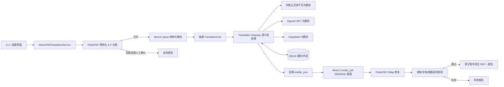

# PDF 文档保真翻译技术方案

**版本：** V2.0

**日期：** 2026-09-26

**适用项目：** 本地文档保真翻译程序

**适用范围：** 具有可靠文字层的中英文 PDF；扫描件 OCR 不属于本期自动翻译范围

**现行主路线：** MinerU 4 结构化解析（`mineru.parser.parse`）+ 项目 Translation Gateway 语义批处理 + MinerU `render_pdf(..., PdfLayout.ORIGINAL)` 版面重建；PyMuPDF 负责预检、候选校验和表格补丁

**后端变更记录（2026-09-26）：** BabelDOC 与 PDFMathTranslate-next 已从运行链路、项目依赖和代码中移除（`pdf_worker.py` 仅保留一个兼容性并发上限函数，不再启动任何子进程或 worker）。MinerU 采用官方基础包 `mineru>=4.0,<5`；不安装 `torch`、`full`、`vllm` 或 `lmdeploy`。默认按 `flash` 档位解析，仅当预检判定为扫描/无文字层（D 类）才切换 OCR 模式。本文取代 V1.1 及更早版本中关于独立 PDF worker、JSON Lines 事件协议和 BabelDOC 中间表示（IL）的全部描述。

**云端翻译：** 阿里云百炼千问大模型 + OpenAI GPT 大模型 + DeepSeek 大模型（2026-09-29 接入，`deepseek-chat`/`deepseek-reasoner`/`deepseek-flash`/`deepseek-v4-pro`，OpenAI 兼容 Chat Completions 端点，`DeepSeekProvider`/`DeepSeekConfig`）

> 本文是 PDF 专项实施与验收基线。它细化《本地文档保真翻译程序技术方案.md》《英译中通用规则.md》和《字体处理方案.md》，不替代三份上位文件。发生冲突时，以用户当前要求和三份上位文件为准。

## 1. 目标与非目标

### 1.1 建设目标

对具有可靠文字层的 PDF 执行中英双向翻译，在不覆盖源文件的前提下生成可复制、可搜索、可稳定显示的译文 PDF，并实现：

- 文本、图片、公式、矢量图形、表格线和页面几何关系尽可能保留；
- 翻译按完整语义单元处理，不把视觉换行误当成自然段；
- 数字、单位、编号、标准号、公式、链接和专有名词可验证地保真；
- 译文版面由 MinerU 的确定性版面重建内核控制，模型只负责翻译，不直接修改坐标或字体；
- 所有失败、回退、字体差异、溢出和人工复核项可追溯；
- 输出通过结构、内容、字体、版面契约四类自动校验，复杂样本再补充人工/视觉复核。

### 1.2 本期不做

- 不自动处理无可靠文字层的扫描 PDF、手写件和轮廓字 PDF；D 类判定后按 OCR 模式尝试，无法可靠恢复文字层的仍拒绝；
- 不绕过密码、权限、数字签名或 DRM；
- 不承诺任意 PDF 像素级一致；
- 不让大模型重画页面、决定坐标或自由改写非文字内容；
- 不以 PyMuPDF“白块遮盖 + 插入文本”作为通用生产回填方案（该模块 `pdf_translation.py` 仅作历史后备，CLI 不再调用）；
- 不翻译公式、代码、文件路径、URL、标准编号和受保护标识；
- 不静默删除无法排入原区域的译文。

## 2. 依赖调研结论

### 2.1 采用的组件

| 组件 | 承担的工作 | 本项目的使用方式 |
|---|---|---|
| [MinerU](https://github.com/opendatalab/MinerU) | 文档版面检测、阅读顺序识别、`parse()` 输出结构化 `middle_json`（页、块、行、span），并提供 `render_pdf(middle_json, layout=PdfLayout.ORIGINAL)` 将回填后的 `middle_json` 重新渲染为保持原版面的 PDF | 唯一的 PDF 解析与版面重建内核；项目在 `mineru_pdf.py` 中原地改写 `middle_json` 里的文本 span，再调用 `render_pdf` 生成候选 PDF |
| [PyMuPDF](https://github.com/pymupdf/PyMuPDF) | 页面几何、字体和文本读取；预检分类；候选文件的结构/字体/版面校验；表格单元格的精确重写 | 预检（`inspect_pdf`）、候选校验（`validate_candidate`）、CMap 修复（`repair_pdf_text_cmaps`）和表格补丁（`pdf_table.py`）；不作为默认的整页回填内核 |

MinerU 只安装基础包（`mineru>=4.0,<5`），不安装 `torch`、`full`、`vllm`、`lmdeploy` 等重量级扩展；默认 `flash` 档位覆盖多数原生文字层 PDF，扫描页（预检 D 类）才切换 OCR 模式。是否需要升级到更高档位由实际黄金样本结果决定，不预先假设。

### 2.2 不直接照搬的部分

- 不直接使用 MinerU 自带的任何翻译或术语功能；所有云端翻译必须经过本项目正式翻译合同（第 6 节）。
- 不允许按每个文本块循环直接发起云端请求；`mineru_pdf.py` 把一次 `parse()` 得到的全部文本单元按固定批量（当前实现为每批 24 个单元）交给 Translation Gateway，不做逐条调用。
- 不把 MinerU 自身的解析缓存当作项目级恢复机制；项目 SQLite 缓存是权威缓存，缓存键覆盖模型、提示词版本和术语版本。
- OCR 模式不等同于可靠 OCR；预检判定为无文字层（D 类）时默认拒绝，仅在明确启用 OCR 模式后按结果重新校验，仍无法通过校验的样本继续拒绝。
- MinerU 的版面识别、字体映射和渲染细节对本项目是黑盒；项目不重新实现通用 PDF 版面识别或字体替换逻辑，只在其输出上做审计（结构、字体嵌入、字号比例、受保护标识）。

### 2.3 许可证边界

MinerU 采用 Apache License 2.0 并附加条款：月活跃用户超过1亿或月收入超过2000万美元的商业使用需另行授权；作为在线服务提供时需履行署名义务；不满足条款时授权自动终止（以官方 `LICENSE.md` 为准）。PyMuPDF 采用 AGPL-3.0 或商业许可（二选一）。个人本地使用与对外分发、提供网络服务的义务不同。项目必须保存依赖版本、许可证文本和修改记录；计划分发安装包或提供服务前，应单独完成许可证合规审查，特别核对 MinerU 附加条款中的规模阈值和署名义务是否触发。本段是工程提醒，不替代法律意见。

## 3. 总体架构



整条链路运行在项目主进程和主虚拟环境内，没有独立的 PDF worker 子进程，也没有跨进程事件协议：`MinerUPdfTranslationService.translate_file` 是一次同步调用，成功返回发布路径、预检结果和报告路径；失败则写入 `status: "FAILED"` 的报告并抛出异常。

### 3.1 组件职责

| 组件 | 只负责 | 不负责 |
|---|---|---|
| `pdf_pipeline.inspect_pdf` | 源文件预检、SHA-256、A-F 分类、判定是否需要视觉复核 | 翻译和写回 |
| `mineru_pdf.MinerUPdfTranslationService` | 调用 MinerU `parse()`/`render_pdf()`、从 `middle_json` 抽取/回填文本单元、串联预检与校验、生成运行记录 | 直接访问云端密钥、决定业务术语、PDF 内部版面算法 |
| Translation Gateway（经 `TranslationBatchProvider.translate_batch`） | provider 路由、批处理、配额、术语、占位符、缓存、重试和结果校验 | PDF 坐标、字体和排版 |
| `pdf_pipeline.validate_candidate` + `pdf_layout.validate_layout_contract` | 候选 PDF 的结构、字体嵌入、字号比例、受保护标识和版面契约校验 | 静默修补失败结果 |
| `pdf_pipeline.repair_pdf_text_cmaps` | 修复 MinerU 渲染产物中已知的合成空格/破折号 CMap 映射问题（只改变文本层语义，不改变可见字形） | 通用字体替换 |
| `pdf_table.py` | 在候选 PDF 上按精确单元格坐标重写表格文字（可选补丁路径） | 表格结构识别（由 MinerU/PyMuPDF 几何提供） |

### 3.2 进程与环境边界

- 主程序、MinerU 和 PyMuPDF 运行在同一个项目虚拟环境（`uv.lock` 锁定），不再维护独立的 `pdf_worker` 虚拟环境或跨进程协议。
- `mineru_pdf.py` 在导入 MinerU 时显式捕获 `ImportError`，未安装时给出安装指引（`uv pip install "mineru>=4.0,<5"`），不静默降级到其他后端。
- 所有中间产物写入 `tempfile.TemporaryDirectory`（与目标文件同一目录），任务结束后自动清理；候选文件通过硬链接原子发布，不做跨进程句柄传递。
- API Key 只由本地 Translation Gateway 持有；MinerU 与 PyMuPDF 均不访问网络凭据。

## 4. PDF 预检与分类

### 4.1 强制预检项（`pdf_pipeline.inspect_pdf`）

1. 校验扩展名为 `.pdf`、文件存在且带有效 PDF 文件头。
2. 计算源文件 SHA-256；`validate_candidate` 在任务结束前重新校验该哈希未变化。
3. 用 PyMuPDF 打开源文件；加密/需要密码的文件直接判为 E 类并拒绝。
4. 按页统计字符数、图片数、矢量绘图对象数、旋转文本行数，并检测表格状网格特征（`_is_table_like_page`）。
5. 记录每页尺寸，供候选文件的页面尺寸一致性校验使用。

### 4.2 分类规则（代码现状）

| 类型 | 判定条件 | 默认动作 |
|---|---|---|
| A 原生流式文本 | 有文字层，且不满足 B/C/D 任一触发条件 | 自动进入 MinerU 解析与渲染；报告状态可直接为 `ACCEPTED` |
| B 复杂原生 PDF | 检出表格状网格、旋转文本，或矢量对象密度超过每页 30 条 | 允许处理，但报告状态强制为 `PENDING_VISUAL_REVIEW`，需要人工确认后才可视为交付完成 |
| C CAD/绘图式 PDF | 平均每页字符数低于 25 且矢量对象密度超过每页 80 条（单字定位、极碎文本的典型特征） | 默认拒绝；需 `--allow-cad-pdf` 并在用户确认源 DWG 不可用后才继续 |
| D 扫描或无文字层 | 全文档字符数为 0 | 切换 MinerU OCR 模式重新解析；仍无法产出可校验文字层时拒绝 |
| E 加密或受限 | `document.needs_pass` 为真 | 拒绝并在报告中说明原因 |
| F 无法解析 | 没有任何页面（空文档或已损坏） | 拒绝，不强行处理 |

B 类和 C 类分别对应 `MinerUPdfTranslationService.translate_file` 中的 `allow_complex_pdf` 与 `allow_cad_pdf` 参数；E/F 类始终抛出 `PdfPreflightError`，不提供绕过开关。任何启发式指标只能用于分类和预警，不能单独证明文档可安全自动写回——B 类候选即使通过全部自动校验，报告状态仍标记为待视觉复核。

## 5. 结构化文档模型与稳定标识

PDF 解析与版面重建使用 MinerU 4 的 `middle_json`（`pdf_info[].para_blocks[].lines[].spans[]`，或其后续格式版本的 `pages[].blocks[]`）。项目不维护独立于 MinerU 输出结构的中间表示；翻译单元的稳定标识和校验完全建立在项目自身的 `TranslationUnit` 模型之上。

### 5.1 翻译单元

`mineru_pdf._extract_text_units` 从 `middle_json` 的每个文本 span 生成一个 `TranslationUnit`（定义见 `document_translator.core.models`）：

```json
{
  "id": "由 document_hash/format/location/source_text 等字段确定性生成",
  "document_hash": "源 PDF 的 SHA-256",
  "format": "pdf",
  "location": {
    "part": "page:<页码>",
    "object_id": "mineru:<block_index>:<child_index>"
  },
  "source_language": "zh-CN",
  "target_language": "en",
  "source_text": "...",
  "protected_tokens": ["按项目占位符规则生成"],
  "style_signature": "MinerU 记录的 block/span 类型（如 text、title）",
  "context_before": "",
  "context_after": ""
}
```

`id` 由 `generate_unit_id()` 基于文档哈希、格式、位置和源文本等字段确定性生成，不使用随机 UUID，保证同一份源文件重复运行时单元 ID 稳定、可与 SQLite 缓存对齐。`context_before`/`context_after` 字段当前未被 `mineru_pdf.py` 填充（保留为空字符串）：跨块上下文暂不参与翻译请求，是已知的当前限制，不在本次变更范围内展开。

图片、图表、表格和公式类型的块（`type` 为 `image`/`chart`/`table`/`equation`/`formula`）在抽取阶段被跳过，不生成翻译单元；表格文字由 `pdf_table.py` 在候选 PDF 层面单独处理（见 7.3）。

### 5.2 保护项

发送模型前必须保护并在返回后恢复，规则由 `document_translator.translation_rules.rule_protected_tokens` 统一实现（与其他格式共用）：

- 数字、小数精度、正负号、百分号、货币和日期；
- 单位、尺寸、公差、桩号、坐标、比例和型号；
- 标准号、合同号、图号、条款号和交叉引用（含中文法律文号，如 `中土经营〔2024〕341 号`）；
- URL、邮箱、路径、文件名、代码和产品名；
- `pdf_pipeline.extract_immutable_identifiers` 额外识别的字母数字复合标识符（如 `ISO-9001`），候选 PDF 中若发现该标识符的 ASCII 拼写被改写（包括被替换为 Unicode 破折号变体）即判校验失败。

恢复后必须验证数量、内容、顺序和数字—单位、编号—名称之间的绑定关系；失败单元不得写入候选 PDF（`_translate_units` 对校验失败或结果集不完整均直接抛出异常，中止整个任务而非静默跳过）。

## 6. 云端翻译与语义批处理

### 6.1 强制调用原则

- 禁止逐条文本发起云端请求；`mineru_pdf._translate_units` 将全部翻译单元按固定批量（当前实现每批 24 个单元）分批调用 `provider.translate_batch()`。
- 根据服务商公开的上下文、单请求大小、RPM 和 TPM 上限决定实际可用的批量上限；固定批量大小需要结合黄金样本和 provider 限额定期复核，不得假设对所有 provider 永远安全。
- 每个请求项携带稳定 `unit.id`；返回结果必须按 ID 绑定（`_translate_units` 显式核对返回 ID 集合与请求集合完全一致，多余或缺失均视为错误）。
- 单批内任一单元的翻译结果未通过 `validate_result_for_unit` 校验，整批调用即失败并中止任务；不做“部分成功、部分回退原文”的静默降级。

### 6.2 与 MinerU 的边界

MinerU 的 `parse()` 一次性返回完整的 `middle_json`，不会像旧方案假设的排版引擎那样并发回调翻译函数；因此项目不需要维护一个拦截并发调用、按 token 上限动态封批的适配器层。翻译发生在“解析已完成、渲染尚未开始”的中间步骤：

1. `parse()` 返回 `middle_json`；
2. 从其中抽取全部 `TranslationUnit`；
3. 分批调用 Translation Gateway，取得译文并回填到对应 span 的 `content`/`text` 字段（`_apply_translation`：首个 span 写入译文，同一单元的其余 span 清空，避免重复显示）；
4. 回填完成后调用 `render_pdf(middle_json, layout=PdfLayout.ORIGINAL)` 一次性生成候选 PDF。

### 6.3 正式请求合同

与其他格式共用同一套结构化 JSON 合同、Provider 路由规则（`qwen`/`gpt` 明确配置、不由环境变量顺序推断）、缓存键组成（`source_text + source_language + target_language + provider + model + prompt_version + glossary_version + protected_items + translation_mode`）和重试策略（仅对 429、临时 5xx、连接中断和超时退避重试；认证失败、Schema 持续失败不无限重试）。这部分与 PDF 后端无关，详见《本地文档保真翻译程序技术方案.md》第 8 节和 `translation_gateway.py`。

## 7. 版面重建策略

### 7.1 标准流水线（`MinerUPdfTranslationService.translate_file` 的实际顺序）

```text
PyMuPDF 预检与 A-F 分类
→ MinerU parse()（flash 档位；D 类切换 OCR 模式）
→ 从 middle_json 抽取 TranslationUnit
→ Translation Gateway 语义批处理翻译
→ 回填 middle_json 对应 span
→ MinerU render_pdf(middle_json, PdfLayout.ORIGINAL) 生成候选 PDF
→ PyMuPDF CMap 修复（repair_pdf_text_cmaps）
→ PyMuPDF 结构/字体/版面契约校验（validate_candidate + validate_layout_contract）
→ 原子发布 + 写入报告
```

### 7.2 保真原则

1. 非文字对象默认不修改；图片、图表、表格、公式块在抽取阶段即被跳过，不进入翻译流程。
2. 模型只返回译文文本，不返回坐标、字号、字体或排版指令；坐标和排版完全由 MinerU 的 `render_pdf` 按 `ORIGINAL` 版面策略控制。
3. 字号验收硬门槛为候选文本对应字号不小于源文本字号的 50%（`validate_candidate` 按每个 span 的渲染原点在源页面中就近匹配对应源 span 比较，不用全页或全文件最小字号代替逐项比较）。
4. 无法通过硬门槛的候选直接判为失败并写入报告，不以白块覆盖、删除内容或极小字号伪装成功。
5. B 类（复杂原生 PDF）即便通过全部自动校验，报告状态仍固定为 `PENDING_VISUAL_REVIEW`，需要人工确认才视为交付完成。

### 7.3 复杂场景策略

| 场景 | 现行策略 |
|---|---|
| 表格 | 抽取阶段跳过表格块的常规翻译路径；`pdf_table.py` 提供基于 PyMuPDF 表格几何和稳定单元格 ID 的独立补丁路径：文字层重写、译文不能在最低可读字号内容纳时判定失败（fail closed） |
| 公式/图片/图表 | 保持原样，不进入翻译单元抽取 |
| CAD 导出 PDF | 预检判为 C 类，默认建议翻译源 DWG；仅在 `--allow-cad-pdf` 且用户确认源文件不可用后处理 |
| 复杂双栏/旋转/密集矢量 PDF | 预检判为 B 类，允许生成候选但报告强制标记待视觉复核 |
| 加密/签名/损坏 PDF | 预检判为 E/F 类，直接拒绝，无处理路径 |

跨页/跨栏段落合并、参考文献重排等更复杂的版面语义目前依赖 MinerU 自身的阅读顺序识别，项目未在其之上做二次段落合并或拆分；这类样本的表现由黄金样本回归观察，不在本文中单独承诺。

## 8. 字体与字符显示

MinerU 的 `render_pdf` 拥有独立的字体选择、映射和嵌入逻辑，对本项目是黑盒：项目不重新实现候选字体匹配、cmap 覆盖分析或字体资产管理流水线（这部分工作此前设想由 BabelDOC 承担，随其移除一并取消，未转移给 MinerU 的公开接口）。项目在字体维度只负责审计和已知问题的定点修复：

### 8.1 项目负责的字体相关工作

- **CMap 修复**（`pdf_pipeline.repair_pdf_text_cmaps`）：已知问题是嵌入字体子集化后，某些字体/缓存组合会把“空格”字形映射为 `U+0000`、`U+0001` 或 `U+0003`，以及模型输出的 Unicode 破折号被渲染进最终字体 CMap；该函数只重写 `ToUnicode` 映射（复制语义），不改变已绘制字形的几何。
- **字体嵌入检查**（`validate_candidate`）：统计候选 PDF 中带字体子集标记的字体引用数量，写入报告，但不对“具体哪种字体被使用”做规则性判断。
- **CJK 残留检查**：当目标语言为英文/拉丁语系时，候选 PDF 中任何残留的 CJK 字符（`㐀`-`鿿`）都会使校验失败，视为未翻译文本，而不是字体缺字问题。
- **字号比例检查**：见 7.2 第 3 条，字号是版面契约的一部分，与字体选择无关。

### 8.2 已知边界

- 若 MinerU 渲染结果出现方框、问号或替换字符（缺字），当前自动校验不会单独检测这类字形级问题；只能通过真实阅读器人工检查发现，需在黄金样本回归中人工确认。
- 项目不维护自己的字体资产清单、版本锁定或许可证台账（此前设想的“字体资产记录文件名、版本、SHA-256 和许可证”随 BabelDOC-Assets 移除一并取消）；MinerU 自带字体资产的版本由其依赖锁定文件（`uv.lock`）间接固定。
- DOCX/PPTX/DWG 路线使用项目自有的 `font_policy.py`（`SimHei`/`Arial`/`Arial Narrow`），与 PDF 路线完全独立，互不影响。

## 9. 输出安全与任务状态

### 9.1 文件安全

- 源 PDF 始终只读，不执行原地覆盖或增量保存；`translate_file` 显式校验 `source == destination` 时直接拒绝。
- 输出路径已存在时拒绝（`FileExistsError`），不做确定性序号重命名或静默覆盖。
- 候选文件写入与目标文件同目录的 `tempfile.TemporaryDirectory`，通过 `publish_candidate` 的硬链接完成原子发布；发布失败（目标已存在）不留下部分写入的目标文件。
- `validate_candidate` 在发布前重新计算源文件 SHA-256 并与预检记录比对，检测任务运行期间源文件是否被修改。

### 9.2 任务状态

当前实现是一次同步函数调用，不维护跨请求的状态机或可恢复的中间状态：

```text
inspect_pdf（预检+分类）
→ parse()（MinerU 解析）
→ 翻译单元抽取与批处理翻译
→ render_pdf()（版面重建）
→ repair_pdf_text_cmaps()（CMap 修复）
→ validate_candidate()（结构/字体/版面契约校验）
→ publish_candidate()（原子发布）
```

任一步失败均抛出异常并中止；`_write_failed_report` 捕获异常后写入 `status: "FAILED"` 的报告（包含预检分类、provider、model、已执行到的 `run` 记录和异常信息），不会留下处于中间状态、无法归类的候选文件。成功路径的报告状态为 `ACCEPTED`（A 类）或 `PENDING_VISUAL_REVIEW`（B 类，见 4.2）。

翻译结果本身经过 Translation Gateway 的 SQLite 缓存（详见上位文件第 6 节），因此中断后重跑同一源文件时已缓存的单元不会重复消耗云端请求；但 PDF 任务本身没有页级进度事件或跨进程恢复协议——这与旧方案设想的 JSON Lines worker 事件协议不同，随 BabelDOC/PDFMathTranslate-next 一并移除，未来如需页级进度展示需另行实现。

## 10. 验收体系

### 10.1 硬门槛

以下任一失败，`validate_candidate` / `validate_layout_contract` 直接抛出异常，输出不得标记为完成：

| 类别 | 硬门槛 | 实现位置 |
|---|---|---|
| 文件安全 | 源文件哈希不变；候选 PDF 非空且可完整解析 | `validate_candidate` |
| 页面结构 | 页数一致；每页尺寸与源文件一致；无空白页 | `validate_candidate` |
| 翻译结果 | 单批请求返回 ID 集合与输入完全一致；结果通过 `validate_result_for_unit` | `mineru_pdf._translate_units` |
| 保护项 | 占位符、数字/单位标识符和中文法律文号的 ASCII/紧凑拼写不变；候选中不得出现被替换为 Unicode 破折号的标识符变体 | `validate_candidate` |
| 文本层安全 | 候选文本层不含非法 C0 控制字符 | `validate_candidate` |
| 语言残留 | 目标语言为拉丁语系时，候选中不得残留 CJK 字符 | `validate_candidate` |
| 字号 | 每处译文字号不小于对应源文字号的 50% | `validate_candidate` |
| 字体 | 候选 PDF 记录嵌入字体引用数量（供报告核查，非强制阈值） | `validate_candidate` |
| 版面契约 | 结构性序号、文档引用字段等 `pdf_layout.validate_layout_contract` 定义的规则全部通过 | `pdf_pipeline.validate_candidate` |
| 复杂样本 | B 类（复杂原生 PDF）报告状态固定为 `PENDING_VISUAL_REVIEW`，需人工确认后才可视为交付完成 | `write_pdf_report` |

### 10.2 当前自动校验未覆盖的部分

以下检查在旧方案中被设想为标准验收项，当前代码未实现，需要在黄金样本回归中依赖人工/视觉复核，不应被误解为已自动化：

- 用两个独立解析器交叉验证输出（当前预检和候选校验均只用 PyMuPDF）；
- 渲染差异图（视觉 diff）与固定 DPI 渲染比较；
- 字形级缺字/替换字符检测；
- 在 Adobe Acrobat Reader、Edge PDF 阅读器等真实应用中的自动化验收。

### 10.3 内容与人工复核

- 报告（第 12 节）按单元记录源文、译文、页码和校验结果，供人工按 unit ID 定位问题。
- 无法确定的人名、地名、缩写、断句进入 `name_warnings`，不单独阻断自动校验；术语库明确指定译法、占位符和受保护标识仍按硬性规则校验。
- 地名、道路名等无权威固定译名的名称不要求“中文译名＋英文原名”并列；中文译名或原英文均可。

## 11. 测试方案

### 11.1 单元与合同测试（现有测试文件）

- `test_pdf_pipeline.py`：预检分类、源哈希、候选校验硬门槛、CMap 修复、原子发布；
- `test_pdf_hybrid_parser.py`：PyMuPDF 几何解析与 MinerU 语义提示的融合逻辑；
- `test_pdf_layout.py`：版面契约（结构性序号、文档引用字段）；
- `test_pdf_table.py`：表格几何提取、单元格映射和最小字号 fail-closed；
- `test_pdf_worker_limits.py`：`pdf_worker.py` 遗留的并发上限兼容函数；
- Provider/Gateway 相关测试（`test_qwen_mt_provider.py`、`test_qwen_chat_provider.py`、`test_openai_provider.py`、`test_deepseek_provider.py`、`test_gateway_diagnostics.py` 等）覆盖与格式无关的路由、缓存、重试和 Schema 校验，PDF 复用同一套合同。

### 11.2 PDF 黄金样本

沿用原方案的样本覆盖范围（单栏、双栏、多页合同、复杂线条表格、公式与参考文献、图片图注、旋转文字、CAD 导出碎片、多字体、以及应被拒绝的扫描/加密/损坏样本），逐一在当前 MinerU 后端上重跑并记录：预检分类是否符合预期、`validate_candidate` 各项检查结果、`PENDING_VISUAL_REVIEW`/`ACCEPTED`/`FAILED` 的实际归类，以及第 10.2 节列出的、仍需人工确认的项目。

### 11.3 回归要求

- 修改 MinerU 版本、`tier`/OCR 参数、`pdf_pipeline.py`、`pdf_layout.py`、Gateway、提示词或术语算法后，必须重跑全部 PDF 黄金样本。
- 修改千问/GPT Provider、接口类型或模型后，先通过正式工程翻译基准，再允许 PDF 自动写回。
- MinerU 版本升级必须先在隔离分支生成对比结果，比较预检分类、批处理单元数和校验通过率的变化，不得直接替换生产锁定版本。

## 12. 复核报告

每次任务至少生成：

```text
原文件名.zh-en.translated.pdf
原文件名.pdf-translation.json
```

报告（`write_pdf_report`）包含：

- `status`：`ACCEPTED` / `PENDING_VISUAL_REVIEW` / `FAILED`；
- `preflight`：源文件哈希、页数、页面尺寸、字符/图片/旋转统计、A-F 分类及理由、是否需要视觉复核；
- `validation`：候选哈希、嵌入字体引用数、空白页、CJK 残留、控制字符、Unicode 破折号、缺失标识符、字号比例明细、版面契约结果；
- `provider`、`model`：实际使用的翻译 provider 与模型；
- `run`：MinerU `tier`、OCR 模式、混合解析统计（原生行数、语义块数、旋转页、表格页）、翻译单元数、CMap 修复记录；
- 失败时额外包含 `error`（异常类型与信息）。

## 13. 项目代码结构（现状）

```text
src/document_translator/
├─ pdf_worker.py                  # 仅保留并发上限兼容函数，不再是子进程 worker
├─ services/
│  ├─ mineru_pdf.py               # MinerU 解析/回填/渲染主流程
│  ├─ pdf_pipeline.py             # 预检、候选校验、CMap 修复、原子发布
│  ├─ pdf_hybrid_parser.py        # PyMuPDF 几何 + MinerU 语义提示融合
│  ├─ pdf_layout.py               # 版面契约（结构性序号、文档引用字段）
│  ├─ pdf_table.py                # 表格几何提取与单元格级重写补丁
│  ├─ pdf_translation.py          # 已废弃的 PyMuPDF 整页回填后备，CLI 不再调用
│  └─ translation_gateway.py      # 与格式无关的 provider 路由、批处理、缓存
└─ adapters/
   └─ pdf.py                      # 供 pdf_translation.py 使用的读取辅助（同为后备路径）

tests/
├─ test_pdf_pipeline.py
├─ test_pdf_hybrid_parser.py
├─ test_pdf_layout.py
├─ test_pdf_table.py
└─ test_pdf_worker_limits.py
```

不再存在独立的 `pdf_worker/` 子项目、`pdf/worker_client.py`、`pdf/batching_translator.py` 或 `protocol.schema.json`——这些是旧方案中为封装 BabelDOC 子进程设计的组件，随其移除一并取消。

## 14. 最终技术决策

1. PDF 主路线采用 MinerU 4 的 `parse()` 结构化解析与 `render_pdf(..., PdfLayout.ORIGINAL)` 版面重建，作为唯一后端；不再维护 BabelDOC/PDFMathTranslate-next 路线或相关依赖。
2. PyMuPDF 只承担预检、候选校验、CMap 修复和表格补丁，不承担通用生产回填（`pdf_translation.py` 仅作历史后备）。
3. 云端翻译接入阿里云百炼千问大模型、OpenAI GPT 大模型和 DeepSeek 大模型（`--provider qwen|gpt|deepseek`）；模型只翻译结构化语义单元，所有请求必须经过项目批量 Translation Gateway。
4. 千问/GPT/DeepSeek Provider、接口类型、模型、术语、提示词、保护算法全部版本化，与 PDF 后端解耦。
5. 扫描件默认拒绝，仅在预检判定为 D 类后尝试 MinerU OCR 模式，仍不可靠则继续拒绝。
6. 源文件永不覆盖；候选结果通过硬门槛后才原子发布；B 类复杂样本始终标记待人工视觉复核。
7. 字体选择、映射和嵌入委托给 MinerU 的内部渲染逻辑；项目只做审计性校验（嵌入字体计数、字号比例、CJK 残留、CMap 定点修复），不重新实现字体资产管理。
8. 对跨页、跨栏、复杂表格、CAD 碎片文字和旋转文字保持明确边界，不宣传“任意 PDF 原样翻译”；第 10.2 节列出的未自动化项目须在黄金样本回归中人工确认。

## 15. 参考资料

- [MinerU GitHub 仓库](https://github.com/opendatalab/MinerU)
- [MinerU 文档](https://opendatalab.github.io/MinerU/)
- [PyMuPDF GitHub 仓库](https://github.com/pymupdf/PyMuPDF)
- [PyMuPDF 官方文档](https://pymupdf.readthedocs.io/en/latest/)
- [阿里云百炼：千问文本生成模型 API](https://help.aliyun.com/zh/model-studio/qwen-api-reference)
- [阿里云百炼：OpenAI 兼容 Chat Completions](https://help.aliyun.com/zh/model-studio/qwen-api-via-openai-chat-completions)
- [阿里云百炼：OpenAI 兼容 Responses API](https://help.aliyun.com/zh/model-studio/qwen-api-via-openai-responses)
- [OpenAI Responses API](https://developers.openai.com/api/reference/cli/resources/responses/methods/create)

> 参考资料核查日期：2026-09-26。实施前必须重新确认上游稳定版本、参数、API 兼容性和许可证，不能仅按本文记录推定仍然有效。
>
> **历史决策说明**：BabelDOC、PDFMathTranslate-next 及围绕它们设计的独立 PDF worker、JSON Lines 事件协议已于 2026-09-26 从运行链路、依赖清单和本文中移除。V1.1 及更早版本中对应章节仅具历史参考价值，不代表当前实现。
